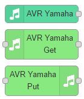
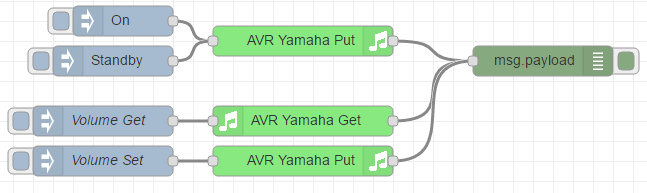

# Node-RED nodes for Yamaha audio/video receiver (AVR)
This package contains nodes for to easily integrate and control YAMAHA™ audio/video receiver from Node-Red (e.g. AVRs like the model Yamaha RX-677).

## Installation
To install globally:

    npm install -g node-red-contrib-avr-yamaha

To install for just the current user (recommended):

    cd ~/.node-red
    npm install node-red-contrib-avr-yamaha

## Usage
There are 3 new nodes which appear in the category 'devices' in your Node-Red palette.

#### AVR Yamaha
The node uses an UPnP-listener and emits a new message when certain events occur on the AVR. Look at `msg.topic` for the type of event and `msg.payload`
for some corresponding event information in JSON encoding.

The list of events is:

 * Power On/Off: When the power state was changed. Outputs current state by reading `System.Power_Control.Power`.
 * Input Changed: When the input selection changed. Outputs current state by reading `Main_Zone.Input.Input_Sel`.
 * Volume Changed: When the current volume setting changed or device is muted. Outputs current state by reading `Main_Zone.Volume.Lvl` and `Main_Zone.Volume.Mute`.
 * Play_Info Changed: When the current track changed. Outputs the current state by reading `<current input selection>.Play_Info`.
 * List_Info Changed: When the current menu list changed. Outputs the current state by reading `<current input selection>.List_Info`.

Note: In most situations, the receiver is sending the event notification multiple times via UPnP. This is not filterd, thus the node might emit the same information multiple times.

#### AVR Yamaha Get
The GET node is used to read different status values of a YAMAHA Audio/Video Receiver. You can select different topics to read the corresponding values
which are returned in `msg.payload`. Most of the payloads are returned as JSON string.

#### AVR Yamaha Put
The PUT node is used to write commands to a YAMAHA Audio/Video Receiver. Select a `msg.topic` in the editor. If no GUI selection is done, then the `msg.topic` is used.

#### Config Node
Use the config node to set the IP address of your receiver. The `port` option allows you to specify the port where the UPnP-device description will be queried. Leave empty for default value of 8080. Other devices, like
TSR-5790 use port 49154.

### Additional Information
Hint: To power on the AVR from remote, the network standby has to be enabled in the internal settings of the AVR.

### Example 1:
The following flow shows same basic control of the AVR.

    [{"id":"9202c38a.6dfd4","type":"avr-yamaha","z":"495ff459.b6a00c","name":"RX-677","address":"192.168.0.30","debug":true},{"id":"864a57c5.79b5a8","type":"AVR-Yamaha-put","z":"495ff459.b6a00c","device":"9202c38a.6dfd4","name":"","topic":"Main_Zone.Power_Control.Power","payload":"","x":330,"y":540,"wires":[["22e54784.dd1ab8"]]},{"id":"8e3e430.f71c1c","type":"inject","z":"495ff459.b6a00c","name":"","topic":"","payload":"On","payloadType":"str","repeat":"","crontab":"","once":false,"x":150,"y":520,"wires":[["864a57c5.79b5a8"]]},{"id":"22e54784.dd1ab8","type":"debug","z":"495ff459.b6a00c","name":"","active":true,"console":"false","complete":"false","x":570,"y":560,"wires":[]},{"id":"3c09a885.c3f658","type":"inject","z":"495ff459.b6a00c","name":"","topic":"","payload":"Standby","payloadType":"str","repeat":"","crontab":"","once":false,"x":140,"y":560,"wires":[["864a57c5.79b5a8"]]},{"id":"395b0593.c6a4fa","type":"AVR-Yamaha-get","z":"495ff459.b6a00c","device":"9202c38a.6dfd4","name":"","topic":"Main_Zone.Volume.Lvl","x":330,"y":620,"wires":[["22e54784.dd1ab8"]]},{"id":"e8c336c6.173cc8","type":"inject","z":"495ff459.b6a00c","name":"Volume Get","topic":"","payload":"","payloadType":"date","repeat":"","crontab":"","once":false,"x":130,"y":620,"wires":[["395b0593.c6a4fa"]]},{"id":"12fbbe4.8614342","type":"AVR-Yamaha-put","z":"495ff459.b6a00c","device":"9202c38a.6dfd4","name":"","topic":"Main_Zone.Volume.Lvl.Val","payload":"{\"Val\":-550, \"Exp\":1, \"Unit\":\"dB\"}","x":330,"y":660,"wires":[["22e54784.dd1ab8"]]},{"id":"ba8d6f4b.6565f","type":"inject","z":"495ff459.b6a00c","name":"Volume Set","topic":"","payload":"Up","payloadType":"str","repeat":"","crontab":"","once":false,"x":130,"y":660,"wires":[["12fbbe4.8614342"]]}]

### Example 2:
The following example shows a flow, that activates the AVR, sets it to a given volume and plays from a net radio. For example, if your AVR stands in the bedroom, you can use it as a radio alarm clock. To make sure, the
AVR doesn't play forever if you're not at home, the sleep timer is activated.

    [{"id":"e451229f.1baee","type":"AVR-Yamaha-put","z":"971b9579.68e468","device":"55fc0160.aa04","name":"Switch On","topic":"System.Power_Control.Power","payload":"On","x":590,"y":340,"wires":[["b0aa51f.f4f55b"]]},{"id":"b0aa51f.f4f55b","type":"AVR-Yamaha-put","z":"971b9579.68e468","device":"55fc0160.aa04","name":"Set Volume","topic":"Main_Zone.Volume.Lvl.Val","payload":"-500","x":590,"y":400,"wires":[["c33d23fd.3cc2e"]]},{"id":"a780c420.587f38","type":"AVR-Yamaha-put","z":"971b9579.68e468","device":"55fc0160.aa04","name":"Play NetRadio","topic":"NET_RADIO.Play_Control.Playback","payload":"Play","x":820,"y":460,"wires":[["8b4530b7.74bad"]]},{"id":"916636b1.6e99c8","type":"debug","z":"971b9579.68e468","name":"","active":true,"console":"false","complete":"false","x":810,"y":520,"wires":[]},{"id":"8b4530b7.74bad","type":"AVR-Yamaha-put","z":"971b9579.68e468","device":"55fc0160.aa04","name":"Activate Sleep","topic":"Main_Zone.Power_Control.Sleep","payload":"30 min","x":600,"y":520,"wires":[["916636b1.6e99c8"]]},{"id":"c33d23fd.3cc2e","type":"AVR-Yamaha-put","z":"971b9579.68e468","device":"55fc0160.aa04","name":"Activate NetRadio","topic":"Main_Zone.Input.Input_Sel","payload":"NET","x":610,"y":460,"wires":[["a780c420.587f38"]]},{"id":"55fc0160.aa04","type":"avr-yamaha","z":"","name":"RX-677","address":"192.168.0.30","debug":true}]

## Open Topics
- The AVR Yamaha node that listens for UPnP events might not work on every system. Most of the time, this is because there is already another
  UPnP service running and blocking port 1900 for other multicast listeners. Also check, that the Topic `System.Misc.Event.Notice` is written to `On`.
- The list of topics in the GUI is from the model RX-677. Although most of the topics are equal for the different Yamaha receivers, there might be some special topics,
  which are missing for newer models.

## History
- 2016-feb-20: 0.1.0 - Created node to read status of the receiver.
- 2016-mar-04: 0.3.0 - GET and PUT nodes are working to read and write to the receiver.
- 2016-mar-17: 0.4.0 - Input node emits new message on volume change, power mode and input change.
- 2016-may-17: 0.5.0 - Fixed errors when writing some values like volume or tuner frequency.
- 2016-sep-11: 0.5.1 - Opening UPnP socket with reuseAddr so there can be more than one UPnP listener running.
- 2016-sep-11: 0.5.2 - Updated readme.
- 2016-sep-11: 0.6.0 - Added new option to config-node, where the port to query the UPnP device description can be specified.
- 2016-sep-25: 0.7.0 - Some fixed in the UPnP-Listener. Also added support for the Events `Play_Info` and `List_Info`.
- 2016-sep-26: 0.7.1 - Now also emitting Mute/Unmute state, when `Volume` event is received.

## Credits
- Sebastian Krauskopf (sebakrau)
- This library uses the yamaha-nodejs library by Pascal Seitz.

## Trademarks
- "YAMAHA" is a registered trademark of Yamaha Corporation.

## License
The MIT License (MIT)

Copyright (c) 2016 sebakrau

Permission is hereby granted, free of charge, to any person obtaining a copy
of this software and associated documentation files (the "Software"), to deal
in the Software without restriction, including without limitation the rights
to use, copy, modify, merge, publish, distribute, sublicense, and/or sell
copies of the Software, and to permit persons to whom the Software is
furnished to do so, subject to the following conditions:

The above copyright notice and this permission notice shall be included in all
copies or substantial portions of the Software.

THE SOFTWARE IS PROVIDED "AS IS", WITHOUT WARRANTY OF ANY KIND, EXPRESS OR
IMPLIED, INCLUDING BUT NOT LIMITED TO THE WARRANTIES OF MERCHANTABILITY,
FITNESS FOR A PARTICULAR PURPOSE AND NONINFRINGEMENT. IN NO EVENT SHALL THE
AUTHORS OR COPYRIGHT HOLDERS BE LIABLE FOR ANY CLAIM, DAMAGES OR OTHER
LIABILITY, WHETHER IN AN ACTION OF CONTRACT, TORT OR OTHERWISE, ARISING FROM,
OUT OF OR IN CONNECTION WITH THE SOFTWARE OR THE USE OR OTHER DEALINGS IN THE
SOFTWARE.
